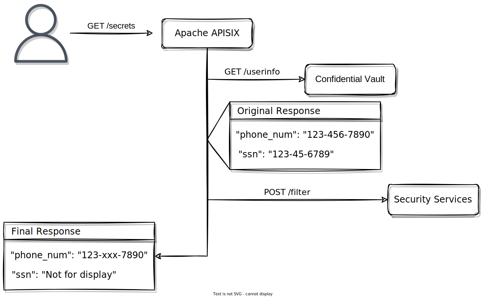

# apisix-pipeline-request-plugin

[![Build Status][badge-action-img]][badge-action-url]

## Table of contents

- [apisix-pipeline-request-plugin](#apisix-pipeline-request-plugin)
  - [Table of contents](#table-of-contents)
  - [Getting Started](#getting-started)
  - [Configuration](#configuration)
  - [Documentation](#documentation)
  - [Useful links](#useful-links)

## Getting Started

What is a pipeline request? It is a plugin that can sequentially request different nodes and pass the response body among them. One can use it to post-process the original response.

When handling client requests, the plugin will iterate through the nodes section of the configuration, requesting them in turn.

In the first request, it will send the complete method, query, header, and body of the client request, while in subsequent requests it will only send the last response with the POST method.

The successful response will be recorded in a temporary variable, and each request in the loop will get the response body of the previous request and overwrite the response body of the current request.

When the loop ends, the response body will be sent to the client as the final response.

[Back to TOC][TOC]

## Configuration

| Name | Type   | Required | Default | Description |
|------|--------|----------|---------|--------------------------------------------------------------------------------------------------------------------------------------------------------------|
| nodes  | array[node] | True    |       | An array of individual request targets, each of which will be requested by the plugin in turn. |
| nodes.[].url | string | True |  | The URL of the target API. |
| nodes.[].ssl_verify | boolean | False | True | Whether to verify the server certificate when requesting. If on then a trust certificate must be configured for APISIX. |
| nodes.[].timeout | integer | False | 3000 | Request timeout time in milliseconds. |
| nodes.[].keepalive | boolean | False | True | Whether to enable HTTP connection pooling. |
| nodes.[].keepalive_timeout | integer | False | 60000 | Survival time of a single HTTP connection in milliseconds. |
| nodes.[].keepalive_pool | integer | False | 5 | The number of connections cached in the HTTP connection pool. |

[Back to TOC][TOC]

## Documentation

- [Basic usage](docs/en/basic.md)

[Back to TOC][TOC]

## Useful links

- [Getting started with GitHub Public Template][github-public-template]
- [What is APISIX Plugin][apisix-plugin]
- [APISIX Architecture Design][apisix-architecture-design]
- [APISIX Plugin Deveolpment][apisix-plugin-develop]
- [APISIX Code Style][apisix-code-style]
- [APISIX Debug Mode][apisix-debug-mode]
- [APISIX Testing Framework][apisix-testing-framework]
- [GitHub Actions][github-actions]

[Back to TOC][TOC]

[TOC]: #table-of-contents

[badge-action-url]: https://github.com/api7/apisix-plugin-template/actions
[badge-action-img]: https://github.com/api7/apisix-plugin-template/actions/workflows/ci.yml/badge.svg

[apisix]: https://github.com/apache/apisix
[apisix-architecture-design]: https://apisix.apache.org/docs/apisix/architecture-design/apisix
[apisix-code-style]: https://github.com/apache/apisix/blob/master/CODE_STYLE.md
[apisix-debug-mode]: https://apisix.apache.org/docs/apisix/architecture-design/debug-mode
[apisix-plugin]: https://apisix.apache.org/docs/apisix/architecture-design/plugin
[apisix-plugin-develop]: https://apisix.apache.org/docs/apisix/plugin-develop
[apisix-plugin-use-template]: https://github.com/api7/apisix-plugin-template/generate
[apisix-testing-framework]: https://apisix.apache.org/docs/apisix/internal/testing-framework

[continuous-integration]: https://en.wikipedia.org/wiki/Continuous_integration

[github-actions]: https://help.github.com/en/actions
[github-public-template]: https://docs.github.com/en/repositories/creating-and-managing-repositories/creating-a-repository-from-a-template